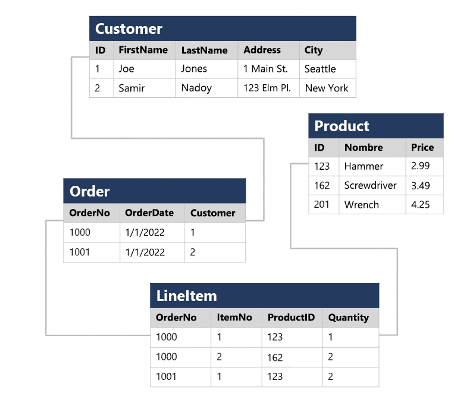

# Exploración de Conceptos Básicos de Datos Relacionales

## Introducción

Cuando se empezaron a usar los sistemas informáticos, cada aplicación almacenaba los datos en su propia estructura, que era única. Cuando los desarrolladores querían crear aplicaciones para usar esos datos, necesitaban mucha información sobre la estructura de datos en particular para encontrar los que necesitaban. Estas estructuras de datos eran ineficaces, costosas de mantener y difíciles de optimizar para que la aplicación tuviera un buen rendimiento. El modelo de base de datos relacional se diseñó para resolver el problema de varias estructuras de datos arbitrarias. El modelo relacional proporciona una forma estándar de representar y consultar datos que cualquier aplicación puede usar. Una de las principales ventajas del modelo de base de datos relacional es su uso de tablas, que son una manera intuitiva, eficaz y flexible de almacenar y acceder a la información estructurada.

El modelo relacional, sencillo pero eficaz, se usa en organizaciones de todo tipo y tamaño para satisfacer diferentes necesidades de administración de la información. Las bases de datos relacionales se utilizan para realizar un seguimiento de los inventarios, procesar transacciones de comercio electrónico, administrar grandes cantidades de información de clientes críticos y mucho más. Las bases de datos relacionales son útiles para almacenar cualquier información que contenga elementos de datos relacionados que se deban organizar en una estructura coherente y basada en reglas.

En este módulo, obtendrá información sobre las características clave de las bases de datos relacionales y explorará las estructuras de datos relacionales.

---

## Comprender los datos relacionales

En una base de datos relacional, modela colecciones de entidades del mundo real como tablas. Una entidad puede ser cualquier cosa para la que desee registrar información; Normalmente, los objetos y eventos importantes. Por ejemplo, en un ejemplo de sistema minorista, puede crear tablas para clientes, productos, pedidos y artículos de línea dentro de un pedido. Una tabla contiene filas y cada fila representa una sola instancia de una entidad. En el escenario comercial, cada fila de la tabla de clientes contiene los datos de un solo cliente, cada fila de la tabla de productos define un único producto, cada fila de la tabla de pedidos representa un pedido realizado por un cliente y cada fila de la tabla de elementos de línea representa un producto incluido en un pedido.

Las tablas relacionales son un formato para los datos estructurados y cada fila de una tabla tiene las mismas columnas; aunque en algunos casos, no todas las columnas necesitan tener un valor; por ejemplo, una tabla de cliente podría incluir una columna MiddleName ; que puede estar vacío (o NULL) para las filas que representan a los clientes sin nombre intermedio o cuyo nombre intermedio es desconocido.

Cada columna almacena datos de un tipo de datos específico. Por ejemplo, es probable que una columna Correo electrónico de una tabla Customer se defina para almacenar datos basados en caracteres (texto) (que podrían ser fijos o variables de longitud), una columna Price de una tabla Product podría definirse para almacenar datos numéricos decimales, mientras que una columna Quantity de una tabla Order podría restringirse a valores numéricos enteros; y una columna OrderDate en la misma tabla Order se definiría para almacenar valores de fecha y hora. Los tipos de datos disponibles que puede usar al definir una tabla dependen del sistema de base de datos que use; aunque hay tipos de datos estándar definidos por el American National Standards Institute (ANSI) que son compatibles con la mayoría de los sistemas de base de datos.

### Diagramas e Ilustraciones de la Unidad

---

## Comprensión de la normalización

La normalización es un término que usan los profesionales de bases de datos para un proceso de diseño de esquemas que minimiza la duplicación de datos y exige la integridad de los datos.

Aunque hay muchas reglas complejas que definen el proceso de refactorización de datos en varios niveles (o formas) de normalización, una definición sencilla con fines prácticos es:

Para comprender los principios básicos de la normalización, supongamos que la tabla siguiente representa una hoja de cálculo que una empresa usa para realizar un seguimiento de sus ventas.

Observe que los detalles del cliente y del producto se duplican para cada artículo individual vendido; y que el nombre del cliente y la dirección postal, y el nombre y el precio del producto se combinan en las mismas celdas de hoja de cálculo.

Ahora veamos cómo cambia la normalización de la forma en que se almacenan los datos.

Cada entidad representada en los datos (cliente, producto, pedido de ventas y elemento de línea) se almacena en su propia tabla y cada atributo discreto de esas entidades se encuentra en su propia columna.

La grabación de cada instancia de una entidad como una fila en una tabla específica de la entidad quita la duplicación de datos. Por ejemplo, para cambiar la dirección de un cliente, solo necesita modificar el valor en una sola fila.

La descomposición de los atributos en columnas individuales garantiza que cada valor esté restringido a un tipo de datos adecuado; por ejemplo, los precios del producto muSt.be valores decimales, mientras que las cantidades de elementos de línea muSt.be números enteros. Además, la creación de columnas individuales proporciona un nivel útil de granularidad en los datos para realizar consultas; por ejemplo, puede filtrar fácilmente a los clientes a aquellos que viven en una ciudad específica.

Las instancias de cada entidad se identifican de forma única mediante un identificador u otro valor de clave, conocido como clave principal; y cuando una entidad hace referencia a otra (por ejemplo, un pedido tiene un cliente asociado), la clave principal de la entidad relacionada se almacena como una clave externa. Puede buscar la dirección del cliente (que se almacena solo una vez) para cada registro de la tabla Order haciendo referencia al registro correspondiente en la tabla Customer . Normalmente, un sistema de administración de bases de datos relacionales (RDBMS) puede aplicar integridad referencial para asegurarse de que un valor especificado en un campo de clave externa tiene una clave principal correspondiente existente en la tabla relacionada; por ejemplo, evitar pedidos para clientes inexistentes.

En algunos casos, una clave (principal o externa) se puede definir como una clave compuesta basada en una combinación única de varias columnas. Por ejemplo, la tabla LineItem del ejemplo anterior usa una combinación única de OrderNo y ItemNo para identificar un elemento de línea de un pedido individual.

### Diagramas e Ilustraciones de la Unidad

---

## Exploración de SQL

SQL significa Lenguaje de consulta estructurado y se usa para comunicarse con una base de datos relacional. Es el lenguaje estándar para los sistemas de administración de bases de datos relacionales. Las instrucciones SQL se usan para realizar tareas como actualizar o recuperar datos de una base de datos. Algunos sistemas comunes de administración de bases de datos relacionales que usan SQL incluyen Microsoft SQL Server, Azure SQL Database, Azure SQL Managed Instance, SQL Server en Azure Virtual Machines, MySQL, PostgreSQL, y Oracle.

SQL fue normalizado originalmente por el American National Standards Institute (ANSI) en 1986, y por la Organización Internacional de Normalización (ISO) en 1987. Desde entonces, el estándar se ha ampliado varias veces, ya que los proveedores de bases de datos relacionales han agregado nuevas características a sus sistemas. Además, la mayoría de los proveedores de bases de datos incluyen sus propias extensiones propietarias que no forman parte del estándar, lo que ha dado lugar a una variedad de dialectos de SQL.

Puede usar instrucciones SQL como SELECT, INSERT, UPDATE, DELETE, CREATE y DROP para lograr casi todo lo que necesita hacer con una base de datos. Aunque estas instrucciones SQL forman parte del estándar SQL, muchos sistemas de administración de bases de datos también tienen sus propias extensiones propietarias adicionales para controlar los detalles de ese sistema de administración de bases de datos. Estas extensiones proporcionan una funcionalidad que no se incluye en el estándar de SQL y contienen áreas como la administración de la seguridad y la capacidad de programación. Por ejemplo, Microsoft SQL Server y los servicios de base de datos de Azure que se basan en el motor de base de datos de SQL Server usan Transact-SQL. Esta implementación incluye extensiones propietarias para escribir procedimientos almacenados y desencadenadores (código de aplicación que se puede almacenar en la base de datos) y administrar cuentas de usuario. PostgreSQL y MySQL también tienen sus propias versiones de estas características.

Algunos dialectos populares de SQL incluyen:

Transact-SQL (T-SQL). Esta versión de SQL la usan Microsoft SQL Server, Azure SQL Database, Azure SQL Managed Instance y SQL Server en Azure Virtual Machines.

pgSQL. Este es el dialecto, con extensiones implementadas en PostgreSQL.

PL/SQL. Este es el dialecto utilizado por Oracle. PL/SQL significa Lenguaje de procedimientos/SQL.

Los usuarios que planean trabajar específicamente con un único sistema de base de datos deben aprender las complejidades de sus dialectos y plataformas SQL preferidos.

Azure SQL Database incluye características de inteligencia artificial que puede usar para escribir y comprender las consultas SQL mediante lenguaje natural.

Los ejemplos de código SQL de este módulo se basan en el dialecto Transact-SQL, a menos que se indique lo contrario. La sintaxis de otros dialectos suele ser similar, pero puede variar en algunos detalles.

Las instrucciones SQL se agrupan en tres grupos lógicos principales:

Las instrucciones DDL se usan para crear, modificar y quitar tablas y otros objetos de una base de datos (tabla, procedimientos almacenados, vistas, etc.).

Las instrucciones de DDL más habituales son las siguientes:

La instrucción DROP es muy potente. Al eliminar una tabla, se pierden todas las filas de esa tabla. A menos que tenga una copia de seguridad, no podrá recuperar estos datos.

En el ejemplo siguiente se crea una nueva tabla de base de datos. Los elementos entre paréntesis especifican los detalles de cada columna, incluido el nombre, el tipo de datos, si la columna siempre debe contener un valor (NOT NULL) y si los datos de la columna se usan para identificar de forma única una fila (CLAVE PRINCIPAL). Cada tabla debe tener una clave principal, aunque SQL no aplica esta regla.

Las columnas marcadas como NOT NULL se conocen como columnas obligatorias . Si omite la cláusula NOT NULL , puede crear filas que no contengan un valor en la columna. Se dice que una columna vacía de una fila tiene un valor NULL .

Los tipos de datos disponibles para las columnas de una tabla variarán entre los sistemas de administración de bases de datos. Sin embargo, la mayoría de los sistemas de administración de bases de datos admiten tipos numéricos como INT (un número entero o entero), DECIMAL (un número decimal) y tipos de cadena como VARCHAR (VARCHAR significa datos de caracteres de longitud variable). Para obtener más información, consulte la documentación del sistema de administración de bases de datos seleccionado.

Los administradores de bases de datos suelen usar instrucciones DCL para administrar el acceso a objetos de una base de datos concediéndoles, denegando o revocando permisos a usuarios o grupos específicos.

Las tres instrucciones DCL principales son:

Por ejemplo, la siguiente instrucción GRANT permite a un usuario denominado user1 leer, insertar y modificar datos en la tabla Product .

Las instrucciones DML se usan para manipular las filas de las tablas. Estas instrucciones permiten recuperar (consultar) datos, insertar nuevas filas o modificar filas existentes. También puede eliminar filas si ya no las necesita.

Las cuatro instrucciones DML principales son:

La forma básica de una instrucción INSERT insertará una fila cada vez. De forma predeterminada, las instrucciones SELECT, UPDATE y DELETE se aplican a todas las filas de una tabla. Normalmente, se aplica una cláusula WHERE con estas instrucciones para especificar criterios; solo se seleccionarán, actualizarán o eliminarán las filas que coincidan con estos criterios.

SQL no proporciona avisos de confirmación ¿está seguro?, por lo que debe tener cuidado al usar DELETE o UPDATE sin una cláusula WHERE, ya que puede perder o modificar una gran cantidad de datos.

El código siguiente es un ejemplo de una instrucción SQL que selecciona todas las columnas (indicadas por *) de la tabla Customer donde el valor de la columna City es "Seattle":

Para recuperar solo un subconjunto específico de columnas de la tabla, los enumere en la cláusula SELECT , de la siguiente manera:

Si una consulta devuelve muchas filas, no aparecen necesariamente en ninguna secuencia específica. Si desea ordenar los datos, puede agregar una cláusula ORDER BY . Los datos se ordenarán mediante la columna especificada:

También puede ejecutar instrucciones SELECT que recuperan datos de varias tablas mediante una cláusula JOIN . Las combinaciones indican cómo se conectan las filas de una tabla con las filas de la otra para determinar qué datos se van a devolver. Una condición de combinación típica empareja una clave foránea de una tabla con su clave principal asociada en la otra tabla.

En la consulta siguiente se muestra un ejemplo que combina las tablas Customer y Order . La consulta usa alias de tabla para abreviar los nombres de tabla al especificar qué columnas se van a recuperar en la cláusula SELECT y qué columnas deben coincidir en la cláusula JOIN .

En el ejemplo siguiente se muestra cómo modificar una fila existente mediante SQL. Cambia el valor de la columna Dirección de la tabla Customer para las filas que tienen el valor 1 en la columna ID . Todas las demás filas se dejan sin cambios:

Si omite la cláusula WHERE , una instrucción UPDATE modificará todas las filas de la tabla.

Use la instrucción DELETE para quitar filas. Especifique la tabla de la que se va a eliminar y una cláusula WHERE que identifique las filas que se van a eliminar:

Si omite la cláusula WHERE , una instrucción DELETE quitará todas las filas de la tabla.

La instrucción INSERT toma una forma ligeramente diferente. Especifique una tabla y columnas en una cláusula INTO y una lista de valores que se almacenarán en estas columnas. SQL estándar solo admite la inserción de una fila a la vez, como se muestra en el ejemplo siguiente. Algunos dialectos permiten especificar varias cláusulas VALUES para agregar varias filas a la vez:

En este tema se describen algunas instrucciones SQL básicas y la sintaxis para ayudarle a comprender cómo se usa SQL para trabajar con objetos de una base de datos. Si desea obtener más información sobre cómo consultar datos con SQL, consulte la ruta de aprendizaje Introducción a las consultas con Transact-SQL en Microsoft Learn.

---

## Descripción de objetos de base de datos

Además de las tablas, una base de datos relacional puede contener otras estructuras que ayudan a optimizar la organización de los datos, encapsular acciones mediante programación y mejorar la velocidad de acceso. En esta unidad, obtendrá información sobre tres de estas estructuras con más detalle: vistas, procedimientos almacenados e índices.

Una vista es una tabla virtual basada en los resultados de una consulta SELECT . Podría decirse que una vista es como una ventana que muestra unas filas concretas de una o varias tablas subyacentes. Por ejemplo, podría crear una vista en las tablas Order y Customer que recuperan los datos del pedido y del cliente para proporcionar un único objeto que facilita la determinación de las direcciones de entrega de los pedidos:

Puede consultar la vista y filtrar los datos de la misma forma que una tabla. La consulta siguiente busca detalles de los pedidos de los clientes que viven en Seattle:

Un procedimiento almacenado define instrucciones&nbsp;SQL que se pueden ejecutar a petición. Los procedimientos almacenados se usan para encapsular la lógica de programación en una base de datos para las acciones que las aplicaciones deben realizar al trabajar con datos.

Puede definir un procedimiento almacenado con parámetros a fin de crear una solución flexible para las acciones comunes que podrían tener que aplicarse a los datos en función de una clave o criterios específicos. Por ejemplo, se podría definir el siguiente procedimiento almacenado para cambiar el nombre de un producto en función del identificador de producto especificado.

Cuando haya que cambiar el nombre de un producto, puede ejecutar el procedimiento almacenado y pasar el identificador del producto y el nuevo nombre que se va a asignar:

Un índice le ayuda a buscar datos en una tabla. Piense en un índice sobre una tabla como en el índice al final de un libro. El índice de un libro contiene un conjunto ordenado de entradas, con las páginas en las que aparece cada una. Cuando quieras encontrar una referencia a un elemento del libro, la buscas en el índice. Puede usar los números de página del índice para ir directamente a las páginas correctas del libro. Sin el índice, es posible que tenga que leer todo el libro para encontrar el contenido que está buscando.

Cuando se crea un índice en una base de datos, se especifica una columna de la tabla; el índice contiene una copia de estos datos con un criterio de ordenación y punteros a las filas correspondientes de la tabla. Cuando el usuario ejecuta una consulta que especifica esta columna en la cláusula WHERE , el sistema de administración de bases de datos puede usar este índice para capturar los datos más rápidamente que si tuviera que examinar toda la fila de tabla por fila.

Por ejemplo, puede usar el código siguiente para crear un índice en la columna Nombre de la tabla Product :

El índice crea una estructura basada en árbol que el optimizador de consultas del sistema de base de datos puede usar para buscar rápidamente filas en la tabla Product en función de un nombre especificado.

Para una tabla que contiene pocas filas, el uso del índice probablemente no sea más eficaz que simplemente leer toda la tabla y buscar las filas solicitadas por la consulta (en cuyo caso, el optimizador de consultas omitirá el índice). Pero cuando una tabla tiene muchas filas, los índices pueden mejorar drásticamente el rendimiento de las consultas.

Puede crear muchos índices en una tabla. Por lo tanto, si también desea encontrar productos basados en el precio, crear otro índice en la columna Precio de la tabla Producto podría ser útil. Sin embargo, los índices no son gratuitos. Un índice consume espacio de almacenamiento y, cada vez que inserte datos en una tabla, los actualice o los elimine, tendrá que hacer el mantenimiento de sus índices. Este trabajo adicional puede ralentizar las operaciones de inserción, actualización y eliminación. Debe conseguir un equilibrio entre tener índices que aceleren las consultas y el coste de realizar otras operaciones.

### Diagramas e Ilustraciones de la Unidad

---

## Evaluación del módulo

Elija la respuesta más adecuada para cada una de las preguntas siguientes.

¿Cuál de las siguientes afirmaciones es una característica de una base de datos relacional?

Todas las columnas de una tabla deben ser del mismo tipo de datos.

Una fila de una tabla representa una única instancia de una entidad.

Las filas de la misma tabla pueden contener columnas diferentes.

¿Qué instrucción SQL se usa para consultar tablas y devolver datos?

CONSULTA

LECTURA

SELECT

¿Qué es un índice?

Una estructura que permite a las consultas localizar filas de una tabla rápidamente.

Una tabla virtual basada en los resultados de una consulta.

Una instrucción SQL predefinida que modifica los datos

¿Cuál de las siguientes instrucciones describe mejor cómo los índices pueden afectar negativamente al rendimiento de la base de datos?

Los índices pueden provocar daños en los datos si no se mantienen y actualizan periódicamente.

Los índices aumentan el riesgo de acceso no autorizado a los datos debido a que facilitan la exposición de los datos de las columnas.

Los índices pueden ralentizar las operaciones de modificación de datos como INSERT, UPDATE y DELETE debido a la sobrecarga adicional de mantener estructuras de índice.

¿Cómo representarías una relación de muchos a muchos entre dos tablas en un esquema de base de datos normalizado?

Mediante la creación de una tabla de unión que incluye claves externas que hacen referencia a las claves principales de ambas tablas

Mediante la adición de varias columnas de clave externa en cada tabla para hacer referencia a la otra tabla

Mediante la combinación de ambas tablas en una sola tabla con todos los atributos

¿Cuál es un síntoma común de un esquema de base de datos desnormalizado?

Eliminación de todas las restricciones de clave externa

Rendimiento mejorado de las consultas sin inconvenientes

Redundancia de datos y anomalías de actualización

¿Qué instrucción SQL usaría para quitar una tabla denominada "OldData" de una base de datos?

DELETE FROM OldData;

DROP TABLE OldData;

ALTER TABLE OldData ELIMINAR;

¿En qué escenario sería más beneficioso usar una vista que consultar directamente las tablas en una base de datos?

Cuando desee aumentar la velocidad de las operaciones de inserción de datos en tablas.

Cuando necesite simplificar consultas complejas que impliquen varias combinaciones y condiciones de filtrado.

Cuando necesite aplicar la integridad de los datos en varias tablas durante las actualizaciones de datos.

¿Cuál de las siguientes indica una infracción del primer formulario normal en un esquema de base de datos?

Una tabla tiene columnas con valores NULL

Una tabla contiene grupos o matrices repetidos dentro de una columna

Una tabla tiene una clave principal compuesta por varias columnas

¿Qué instrucción SQL recupera correctamente "ProductName" y "Price" de la tabla "Products" para los productos con un precio inferior a 10?

SELECCIONAR * DE Productos DONDE NombreProducto Y Precio &lt; 10;

SELECT ProductoNombre, Precio FROM Productos WHERE Precio &lt; 10;

SELECT ProductName, Price WHERE Price &lt; 10 FROM Products;

¿Qué escenario ilustra una desventaja de usar vistas en una base de datos?

Las vistas pueden actualizar automáticamente las tablas base cuando los datos se modifican en la vista.

Las vistas aumentan los riesgos de seguridad, ya que exponen estructuras de tabla subyacentes a los usuarios.

Las vistas pueden provocar problemas de rendimiento con consultas complejas, ya que no almacenan los datos y dependen de consultar las tablas base cada vez.

¿Qué instrucción SQL usaría para crear una tabla denominada "Books" con las columnas "ISBN" como clave principal y "Title" como NOT NULL?

CREAR TABLA Libros (ISBN CLAVE PRIMARIA VARCHAR, Título NO NULO VARCHAR);

CREAR TABLA Libros (ISBN INT CLAVE PRIMARIA, Título VARCHAR(255) NO NULO);

CREATE TABLE Libros (ISBN VARCHAR(255), Title VARCHAR(255));

---

## Resumen

Las bases de datos relacionales son una manera común de que las aplicaciones transaccionales almacenen y administren datos. Constan de un esquema de tablas, que están vinculados a través de valores de clave comunes. Use SQL para consultar y manipular los datos de las tablas y puede enriquecer la base de datos mediante la creación de objetos como vistas, procedimientos almacenados e índices.

En este módulo ha aprendido a:

Ahora que ha aprendido sobre las bases de datos relacionales, considere la posibilidad de obtener más información sobre las cargas de trabajo relacionadas con los datos en Microsoft Azure mediante la realización de una certificación de Microsoft en Aspectos básicos de datos de Azure.

Elija la cuenta de Azure adecuada para usted. Pague a medida que habla o pruebe Azure gratis durante 30 días.
			Regístrese.

---

